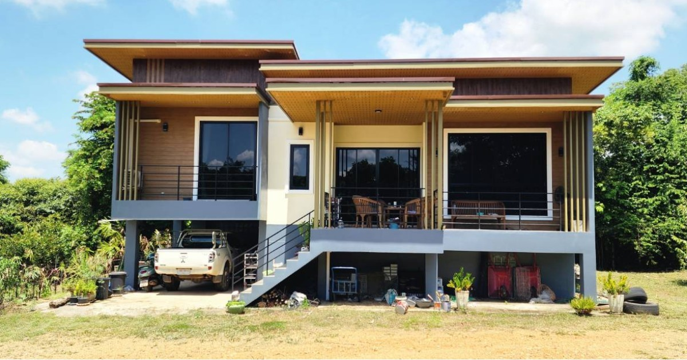
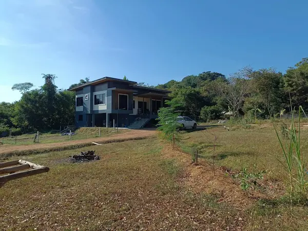
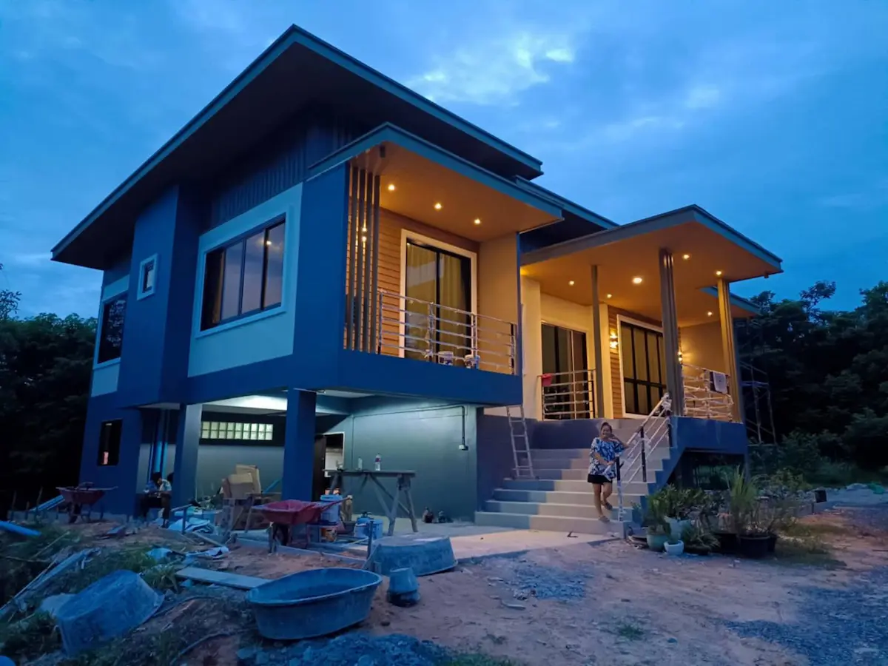
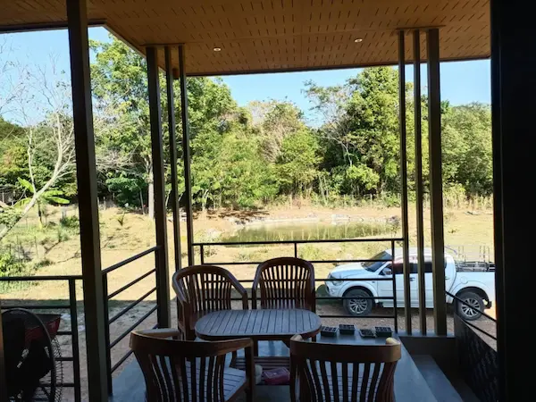
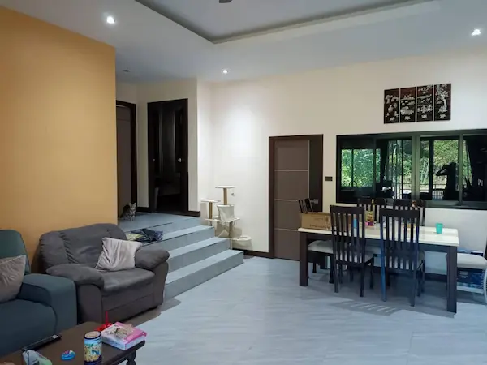
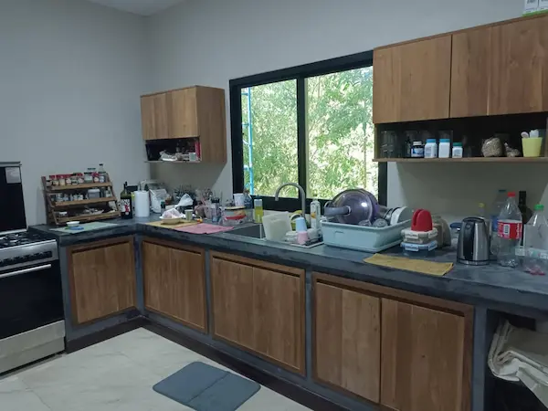
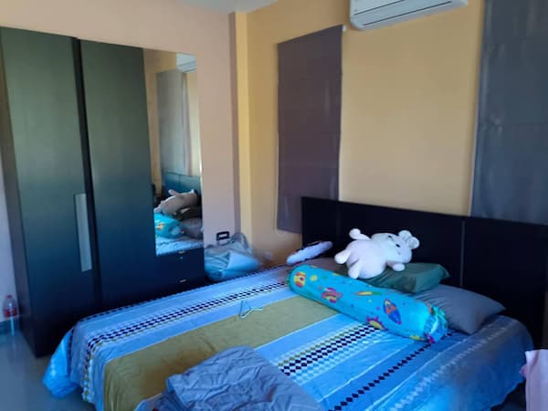

# 🏡 House & Land for Sale in Rayong, Thailand | Beautiful Tropical Property

A beautifully maintained home set in tropical gardens, offering peace, privacy and easy access to Rayong's beaches and amenities.

Welcome!

This page provides a brief overview of a unique property for sale in Rayong, Thailand.

## Why You'll Love This Property

- 🌴 Peaceful location
- 🏠 Spacious home
- 🌺 Beautiful gardens
- 🌞 Ideal retirement or family property
- 🇹🇭 Located on Thailand's beautiful Eastern Seaboard

---

## 🌐 Full Property Website

👉 **[View the complete property details, photo gallery and contact information](https://shopbeachwearonline.com/house-for-sale-rayong-thailand/)**

---

## ⭐ Property Highlights

- Approximately 2 Rai of landscaped land
- Comfortable family home
- Beautiful tropical gardens and surroundings
- Quiet countryside location
- Easy access to Rayong City and local beaches
- Ideal family home, retirement property or investment

---

---

## 📞 Interested?

For the complete property description, full photo gallery and contact information, please visit:

👉 **[House & Land for Sale in Rayong, Thailand](https://shopbeachwearonline.com/house-for-sale-rayong-thailand/)**

Thank you for visiting.

---

## 📍 Why Rayong?

Rayong is one of Thailand's most attractive provinces, offering beautiful beaches, excellent shopping, modern hospitals, international schools, golf courses and a relaxed lifestyle while remaining within easy reach of Bangkok.
Thank you for visiting.
